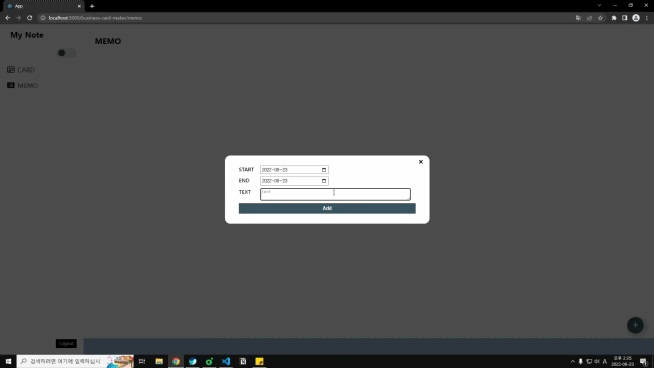

# My Note

### 1. 목적

- React, Firebase, PostCSS, cloudinary를 사용하여 명함과 메모 저장 기능 앱 만들기

### 2. 구성

- login
  - GitHub와 Google 계정을 이용하여 로그인하도록 구현하였다.
  

  
  

- logout
  - 메뉴 오른쪽 아래에 있는 logout 버튼을 누르면 logout 되며 다시 login 페이지로 이동하게 된다.
  

  
  

- card
  - 오른쪽 하단 + 모양 버튼을 누르면 새로운 명함을 추가할 수 있다.
    

    
    

  - 명함의 이름 옆 연필모양 아이콘을 누르면 명함의 내용을 수정할 수 있으며 x 모양을 누르면 card를 삭제할 수 있다.
    

    
    
    

  - 이미지를 추가하지 않으면 기본이미지가 적용된다.
- memo
  - 오른쪽 하단 + 모양 버튼을 누르면 새로운 메모를 추가할 수 있다.
    

    
    

  - 연필모양 아이콘을 누르면 메모 수정, x 모양 아이콘을 누르면 메모가 삭제 된다.
    

    
    
    

- dark mode, light mode
  - 메뉴 오른쪽 상단 쯤에 위치한 버튼을 누르면 dark mode, light mode로 변경 가능하다.
  - localStorage를 이용하여 dark mode, light mode를 저장하도록 구현하였다. (기본값은 light mode)
    

    
    

  - 메뉴는 화면의 크기에 따라 반응형으로 동작한다.
    

    
    

### 3. 개선할 사항

- [ ] 나름 다크모드 라이트 모드를 구현하긴 했으나 useState를 사용하여 props를 계속 넘겨주는 식으로 구현하여 뭔가 지저분 한것 같고 더 좋은 방법으로 개선해야 할 것 같다. ~~또 다크모드 디자인이 너무 구리다..~~
- [ ] 메모 기능이 너무 한정적이다. 지금은 단순하게 날짜와 내용만 입력하게 만들었으나 완료 상태를 입력하게 한다던가 Trello나 Notion 같은 기능을 추가해보고 싶다.
- [ ] 지금의 로그인 기능은 GitHub와 Google 로그인만 가능하지만 이메일과 비밀번호를 이용하여 로그인이 가능 하도록 추가할 예정이다.
- [ ] 이미지 업로드에 cloudinary를 사용하였는데 지금 상태에서는 저장소에 이미지가 계속 쌓이는 형태로 구현되어 있다. 무료 사용에는 용량 제한이 있으므로 새로운 이미지가 올라오면 삭제하도록 코드를 수정할 필요가 있다.
- [ ] card에 이미지 삭제 기능을 추가할 필요가 있다.
